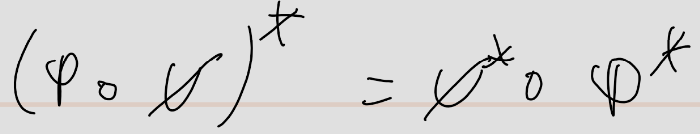

pdf:: ((67153db8-77ff-443f-ae24-ca9a42770fb4))
alias:: duale Abbildung
tags:: lineare Abbildung, #Vektorraum

- **Definiton:**
	- nummer:: 2.5.16
	  pdf:: ((67153df9-4bb4-4e09-8794-4c9e57532eed))
	- 
- **Satz:**
	- nummer:: 2.5.18
	  pdf:: ((67153ead-bdc2-4956-a815-2f79fa441c1b))
	- 
- **Satz:**
	- nummer:: 2.5.19
	  pdf:: ((67153ffc-a346-4c0f-adfe-b0df4b7cf881))
	- 
- **Satz:**
	- nummer:: 2.5.20
	  pdf:: ((67154055-42e8-47d4-b065-0c41e4c8ce71))
	- 