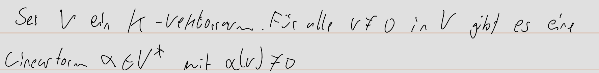

pdf:: ((671532ea-5a11-4094-ad9a-82757776b048))
tags:: Homomorphismus, #Vektorraum, #Körper, #[[Lineare Abbildung]]
alias:: Linearform, Linearformen, Dualbasis

- {{embed [[Homomorphismus]]}}
- **Definition:**
	- nummer:: 2.5.3
	  pdf:: ((671533ef-3036-42b5-be69-0058c0863874))
	- 
	- Ist V von Dimension n, so hat der Dualraum V* ebenfalls Dimension n und beide sind #Isomorph
- **Lemma:**
	- nummer:: 2.5.6
	  pdf:: ((67153940-5a89-4376-a274-048068ddee36))
	- 
- **Notation:**
	- nummer:: 2.5.8
	  pdf:: ((67153a0d-2461-456d-80f8-bbc06067dcd3))
	- 
- **Definition:**
	- nummer:: 2.5.10
	  pdf:: ((67153abb-d4f5-4559-88f2-d27434687d72))
	- 
	- ist B geordnet ist B* geordnet
	- Dualbasis berechnen:
	  collapsed:: true
		- 