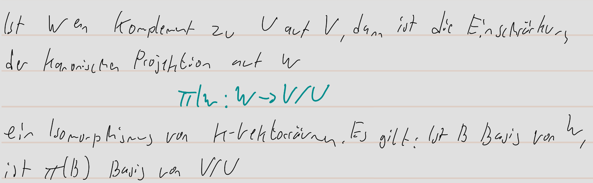

pdf:: ((671527b9-5354-4800-8983-f195a7c9e368))
tags:: Komplement, [[Isomorphismus]], [[Vektorraum]], [[Basis]], kanonische Projektion

- **Satz:**
	- nummer:: 2.4.18
	  pdf:: ((67152de0-87b3-4f94-85ef-2774ec7c98df))
	  tags:: Komplement, [[Isomorphismus]], [[Vektorraum]], [[Basis]], kanonische Projektion
	- 
	- Beispiel:
	  collapsed:: true
		- 
- **Korollar:**
	- nummer:: 2.4.21
	  pdf:: ((67153197-7d9f-46dd-9369-855acb744675))
	  tags:: Vektorraum, #Unterraum, #Isomorphismus
	- 
- **Korollar:**
	- nummer:: 2.4.22
	  pdf:: 
	  tags:: Vektorraum
	- 