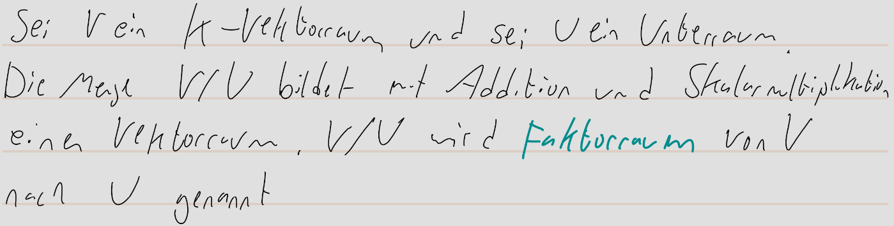
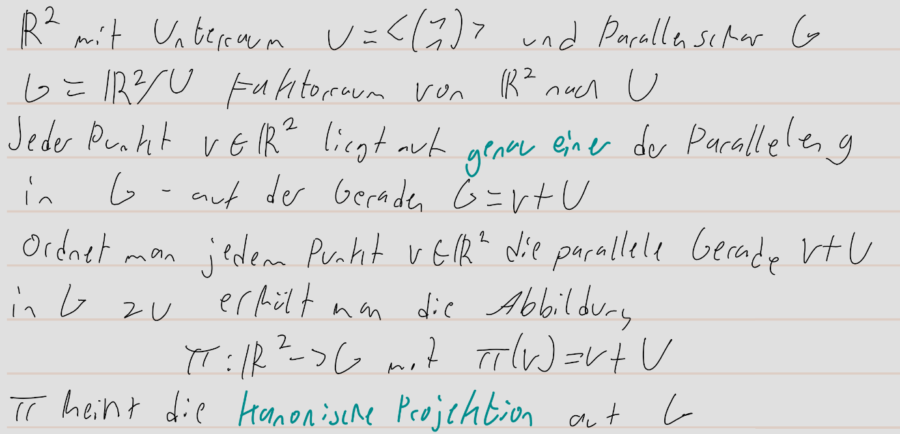
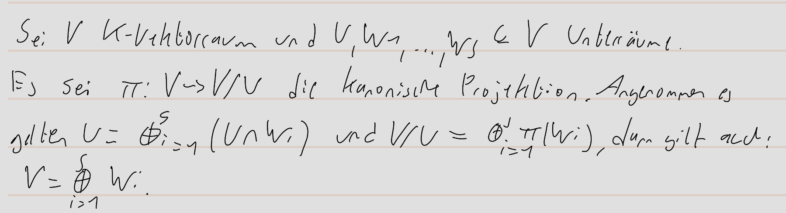

pdf:: ((6715096f-d4c7-4b06-a59f-875a86589803))
alias:: Konstruktion [[Faktorraum]], kanonische Projektion
tags::  #Vektorraum, #Unterraum, #[[affiner Unterraum]]

- {{embed [[Faktorräume/affiner Unterraum]]}}
- **Definition [[Faktorraum]]:**
	- pdf:: ((671523d3-1141-424c-9599-ba8eb7d1b252))
	  nummer:: 2.4.11
	- 
- **Kanonische Projektion auf die Parallelenschar:**
  id:: 6715248f-8bbd-448e-9251-9bcb314cfc21
	- 
- **Faktorabbildung:**
	- pdf:: ((671525fe-cce0-4960-8c35-97fd3e7c0f44))
	  nummer:: 2.4.13
	  
- **Lemma:**
	- pdf:: ((671526ba-64d3-4f16-a382-7c0f4173754b))
	  nummer:: 2.4.14
	  tags:: direkte Summe
	  