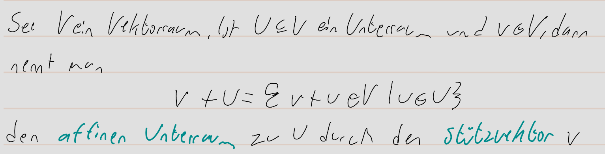
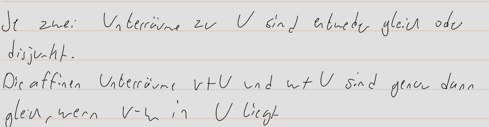
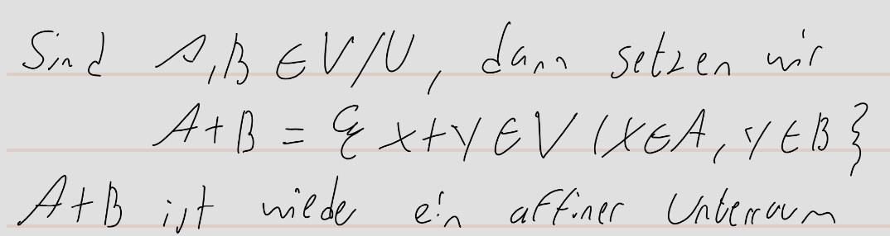
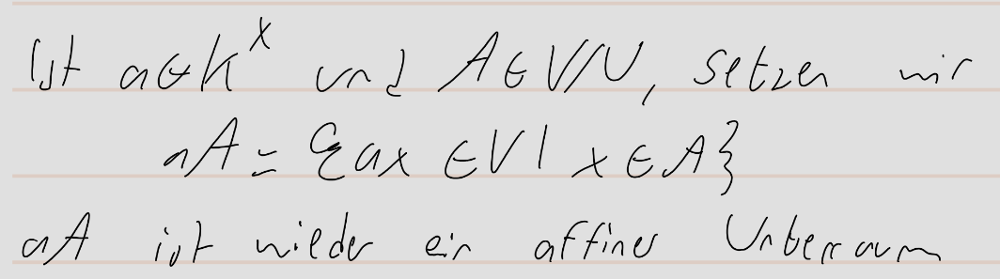

alias:: affiner Unterraum, 2.4.2, 2.4.5, 2.4.7
pdf:: ((67150a80-850a-44b7-b6b1-a176315a6b27))
tags:: Vektorraum, Unterraum

- **Definition:**
	- 
- Ein affiner Unterraum ist im Allgemeinen **kein** [[Unterraum]]
	- Beispiel: Lösungsmenge L eines LGS: L = x0 + U
- 
- **Menge der affinen Unterräume:**
	- 
- **Addition affiner Unterräume: **
	- 
- **Skalarmultiplikation mit affinen Unterräumen:**
	- 