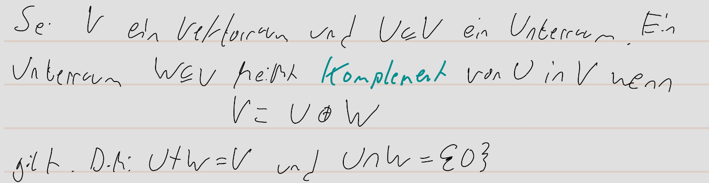
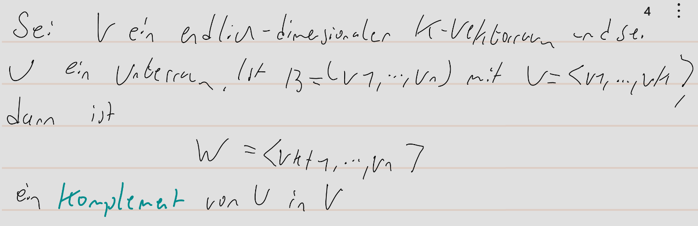

pdf:: ((671501ef-adb2-433e-8c21-52956a48796c))
alias:: Komplement, 2.3.14, 2.3.19
tags:: Unterraum, [[Vektorraum]], [[Basis]], direkte Summe

- 
- 
- 
- \Rightarrow Ein Komplement bestimmt man, indem man die [[Basis]] von U zu einer [[Basis]] von V ergänzt