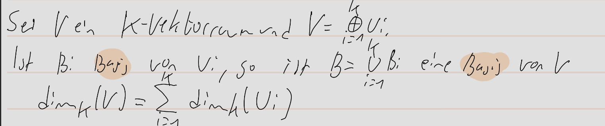
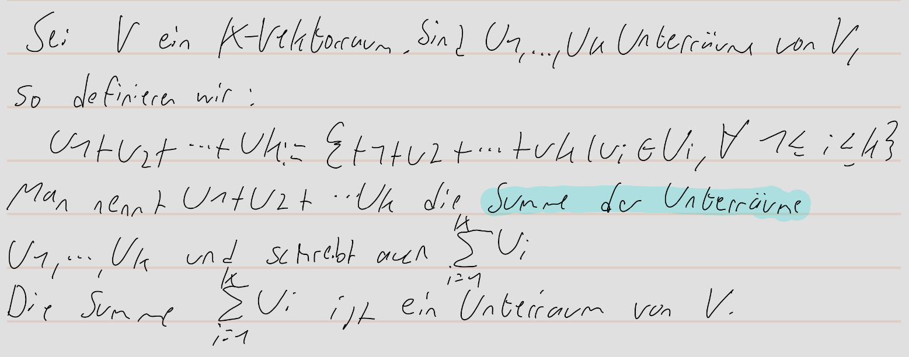
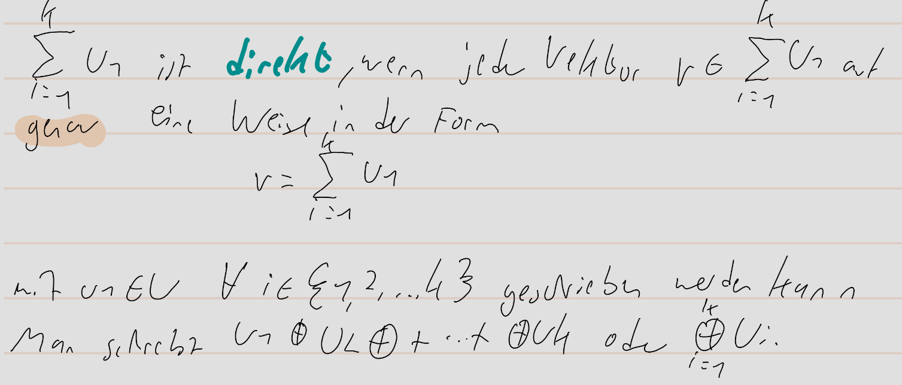
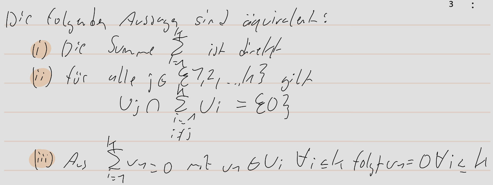

pdf:: ((6714f24d-baf6-4df3-b015-5e34563062da))
alias:: 2.3.1, 2.3.5, 2.3.6, 2.3.7,2.3.12, direkte Summe
tags:: Vektorraum, Unterraum, [[Basis]]

- **Definition:**
	- 
- **direkte Summe:**
	- 
	- Äquivalent dazu:
	- 
	- 
-