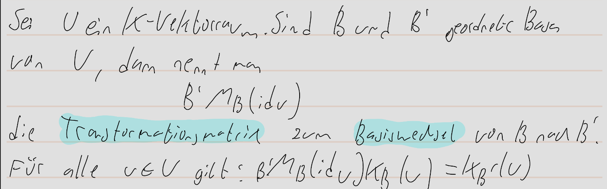
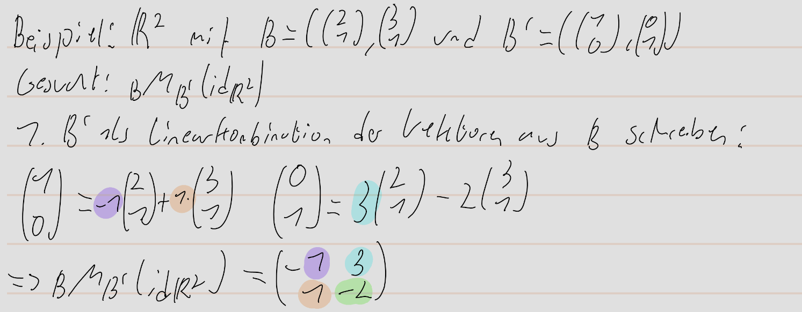
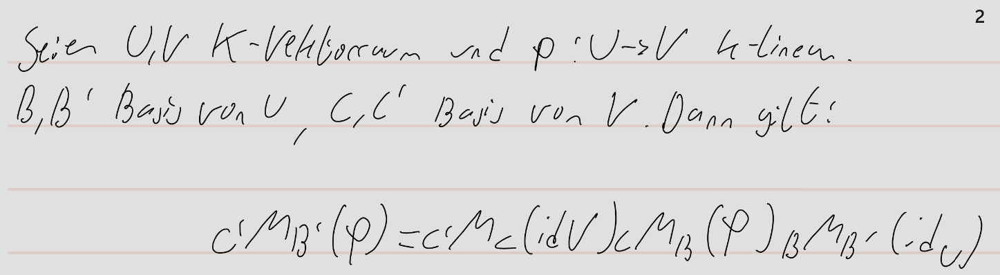

alias:: Basiswechsel, Transformationsmatrix, 2.2.26, 2.2.28, Transformationsformel
tags:: Vektorraum, [[Basis]], [[lineare Abbildung]]
pdf:: ((6714efe6-13ba-4459-bc2d-c511dd77778a))

- 
- Beispiel:
  collapsed:: true
	- 
- **Transformationsformel für lineare Abbildungen:**
	- 