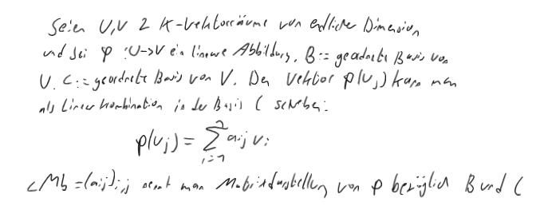

- ((67115cf8-6a2f-4e7b-951b-648150efd5d4))
- **K-Linear**
	- **Definition:** Seien U und V zwei K-Vektorräume. Eine Abbildung ϕ : U → V nennt man ==K-linear==, wenn folgende Bedingungen erfüllt sind: #card
	  id:: 6717edb4-33ec-4d60-b6be-855a287956d5
		- (L1) ϕ(u1 + u2) = ϕ(u1) + ϕ(u2) für alle u1, u2 ∈ U
		- (L2) ϕ(au) = aϕ(u) für alle a ∈ K und u ∈ U
		- Beispiel
		  collapsed:: true
			- [[draws/2024-10-17-20-56-45.excalidraw]]
- {{embed [[Kern]]}}
- {{embed [[Isomorphismus]]}}
- {{embed [[Koordinaten]]}}
- **Matrixdarstellung:**
	- 
	- Die [[Lineare Abbildung]] ist eindeutig durch die Bilder der Baisvektoren festgelegt
- {{embed [[Lemma 2.2.25]]}}
- {{embed [[Transformationsmatrizen]]}}