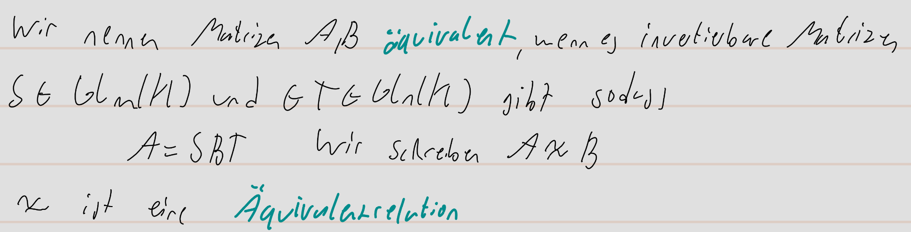
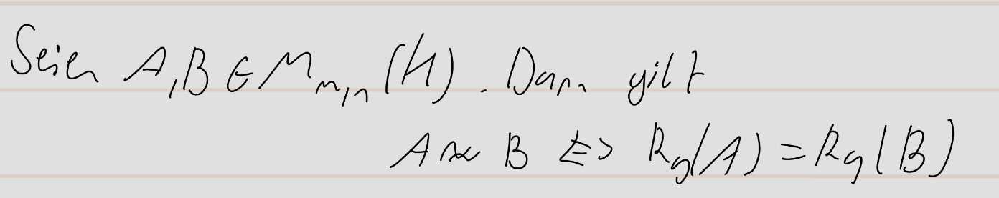
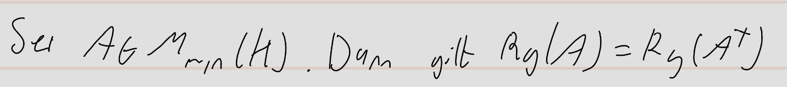

pdf:: ((671544fb-d10a-422e-b7f1-68cad2715b19))

- **Definition äquivalent:**
	- nummer:: 2.6.13
	  pdf:: ((67154527-0db1-4f49-a298-9e9a53e5bcea))
	- 
- **Satz:**
	- nummer:: 2.6.15
	  pdf:: ((6715461c-b331-4d31-9821-38af907a9472))
	- 
- **Korollar:**
	- nummer:: 2.6.16
	  pdf:: ((6715468c-ee5e-4d91-b8a8-5511edf1e80b))
	- 